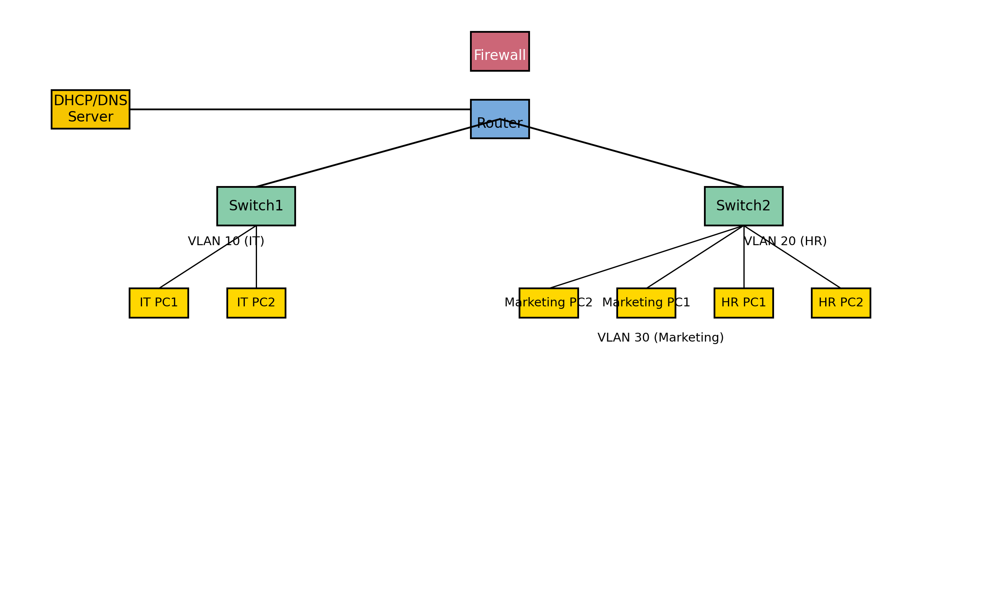

# Enterprise Network Buildout & Documentation

This project simulates building a complete network infrastructure for a small/medium business. It demonstrates how to design, configure and document a multi‑subnet environment with VLAN segmentation, DHCP/DNS services, routing protocols and access controls.

## Topology

The lab uses a virtual router connected to two switches. The switches are segmented into VLANs (VLAN 10 for IT, VLAN 20 for HR and VLAN 30 for Marketing). A DHCP/DNS server provides network services, and a firewall sits between the network and the internet. Clients in each VLAN communicate through the router.

## Prerequisites

* Virtualization platform (e.g., VirtualBox, VMware Workstation).
* Network emulation software such as Cisco Packet Tracer, GNS3 or EVE‑NG.
* Virtual machine images for servers (e.g., Windows Server or Linux) and clients.

## Steps

1. **Design the topology.** Plan the IP addressing scheme and VLAN assignments. VLANs allow a single physical switch to operate as multiple virtual switches; traffic cannot cross VLAN boundaries without a router【554230438183839†L60-L92】.
2. **Create the network topology.** In your chosen emulator, add a router, two switches, a DHCP/DNS server and multiple client machines. Assign ports on the switches to VLAN 10 (IT), VLAN 20 (HR) and VLAN 30 (Marketing).
3. **Configure core services.**  
   * Install and configure a DHCP server to automatically assign IP addresses within each subnet.  
   * Configure a DNS server to resolve internal hostnames.
4. **Implement VLANs.**  
   * On each switch, create VLAN 10, VLAN 20 and VLAN 30 and assign the appropriate interfaces.  
   * Configure the router’s sub‑interfaces and enable inter‑VLAN routing so that devices in different VLANs can communicate through the router.
5. **Configure routing.** Choose a dynamic routing protocol such as OSPF or EIGRP and configure it on the router to advertise the VLAN subnets. Verify that routing tables are populated and hosts can reach other subnets.
6. **Add security controls.**  
   * Apply Access Control Lists (ACLs) on the router to restrict traffic between sensitive VLANs.  
   * Optionally configure a basic firewall on a server to block unwanted inbound connections.
7. **Document the build.** Use a tool like Draw.io or Lucidchart to produce a professional network diagram. Document each device’s configuration, IP addressing, VLAN assignments and routing protocol settings. Explain any issues encountered and how they were resolved.

## Conclusion

This lab demonstrates a structured approach to designing and building an enterprise network. By segmenting the network with VLANs, automating IP assignment with DHCP and using dynamic routing protocols, you can create a scalable and secure infrastructure. Applying ACLs further controls traffic between segments and enforces security policies.